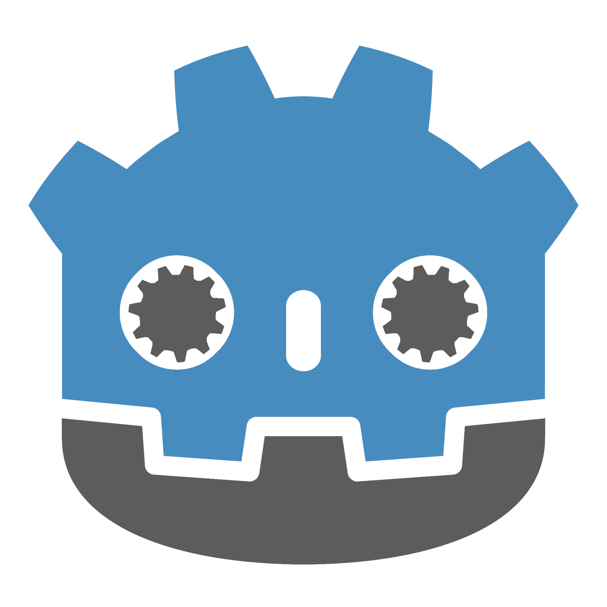

# GDScript Mod Loader

 

A generalized Mod Loader for GDScript-based Godot games.  
The Mod Loader allows users to create mods for games and distribute them as zips.  
Importantly, it provides methods to change existing scripts, scenes, and resources without modifying and distributing vanilla game files.

## Features
- Loading ZIPs as mods into the running game
  - Makes every script and resource moddable
  - Vanilla game files are not shared in mods
  - Disabled mods leave no trace
  - since Godot 4: workaround to mod scripts using `class_name`
  - Mod metadata
    - Compatibility checks between game and mod version
    - Load order/dependencies between mods 
    - General info like author and version
- Mod Configs
  - Settings for each individual mod
- Mod Profiles
  - Lists of mods and configurations that can easily be enabled and disabled
- Unified logging system for mods
- Mod Loader Options
  - allowing different Mod Loader settings per-feature
- Built in Mod Sources:
  - Steam Workshop
  - Thunderstore
  - Local /mods folder
- Self Setup for mods that don't have the Mod Loader preinstalled

## Getting Started

You can find quickstart guides and more on the [Wiki](https://wiki.godotmodding.com/).

## Godot Version
The Mod Loader is developed for Godot 3 and 4.  
You can find a stable Godot 3 version on the releases page [Godot 3.x - v6.3.0](https://github.com/GodotModding/godot-mod-loader/releases/tag/v6.3.0) and the [Godot Asset Lib](https://godotengine.org/asset-library/asset/1938).   
For Godot 4 you can find the latest releases on the [Releases Page](https://github.com/GodotModding/godot-mod-loader/releases) and the [Godot Asset Lib](https://godotengine.org/asset-library/asset/4107).

## Development
The latest work-in-progress build can be found on the [4.x-dev branch](https://github.com/GodotModding/godot-mod-loader/tree/4.x-dev) for Godot 4 and [3.x-dev](https://github.com/GodotModding/godot-mod-loader/tree/3.x-dev) for Godot 3.

## Compatibility
The Mod Loader supports the following platforms:
- Windows
- macOS
- Linux
- Android
- iOS

## Keep in touche
For more details and updates join us on [our Discord](https://discord.godotmodding.com).

## Games Made Moddable by This Project
- [Brotato](https://store.steampowered.com/app/1942280/Brotato/) by 
[Blobfish Games](https://store.steampowered.com/developer/blobfishgames)
- [Dome Keeper](https://store.steampowered.com/app/1637320/Dome_Keeper/) by 
[Bippinbits](https://store.steampowered.com/developer/bippinbits)
- [Endoparasitic](https://store.steampowered.com/app/2124780/Endoparasitic/) by [Miziziziz](https://www.youtube.com/@Miziziziz)
- [Windowkill](https://store.steampowered.com/app/2726450/Windowkill/) by [torcado](https://store.steampowered.com/developer/torcado)
- [Of Life and Land](https://store.steampowered.com/app/1733110/Of_Life_and_Land/) by [Kerzoven](https://store.steampowered.com/search/?developer=Kerzoven)
- [Dawnfolk](https://store.steampowered.com/app/2308630/Dawnfolk/) by [Darenn Keller](https://store.steampowered.com/developer/darennkeller)
- [The Deadseat](https://store.steampowered.com/app/3667230/The_Deadseat/) by [Curious Fox Sox](https://store.steampowered.com/search/?developer=Curious%20Fox%20Sox)
